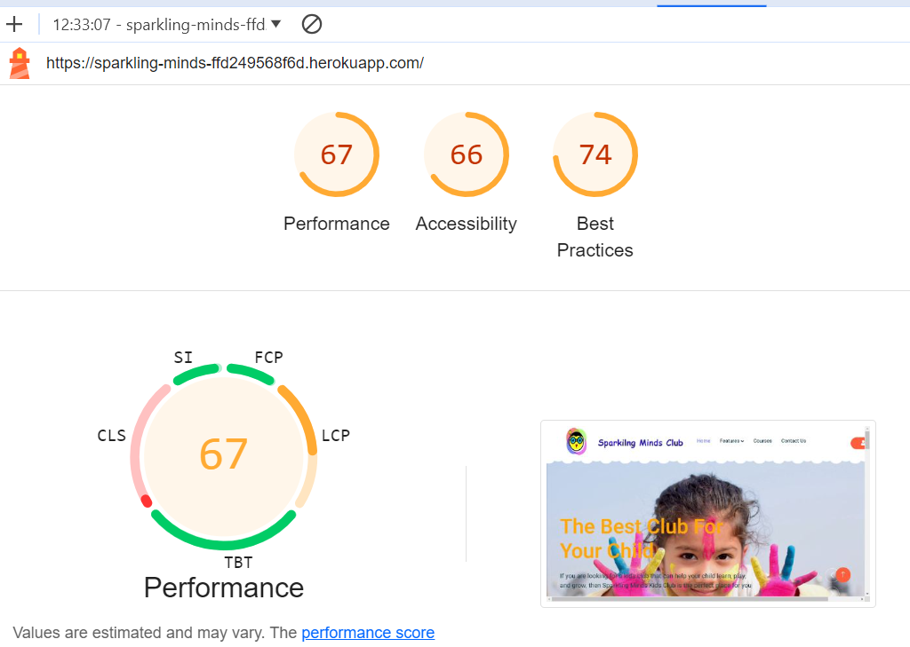
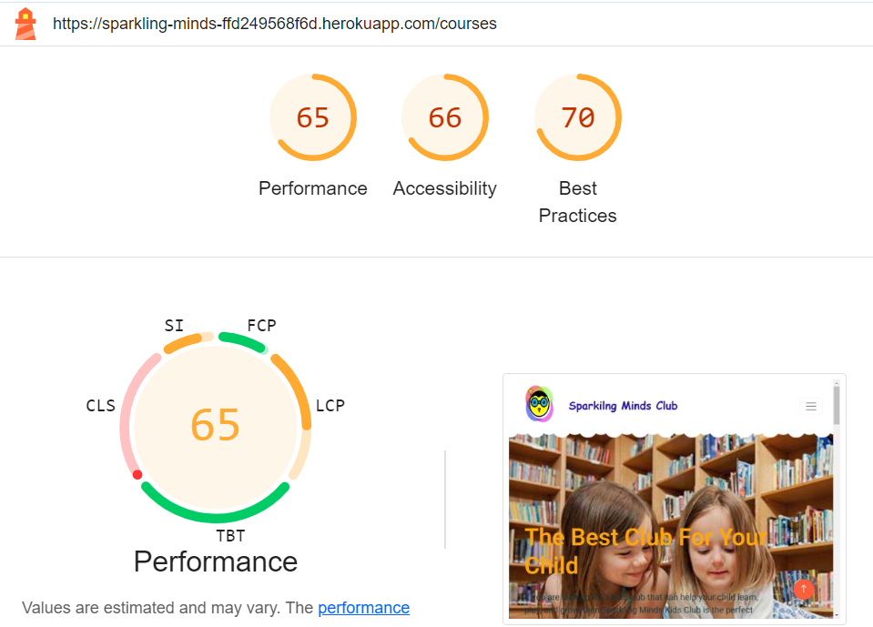
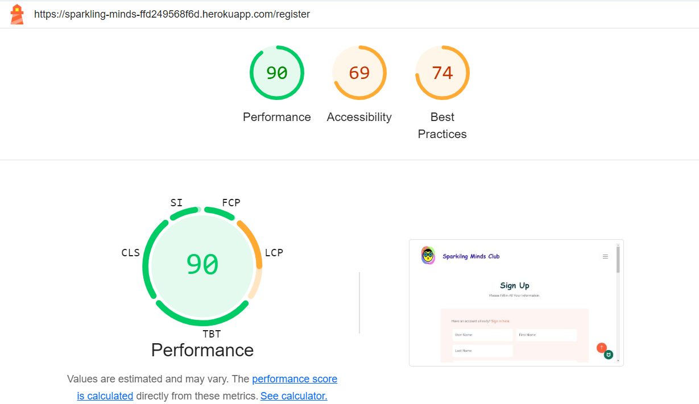
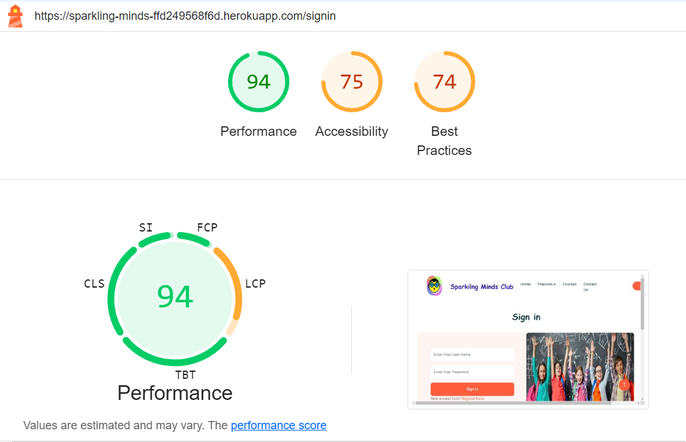
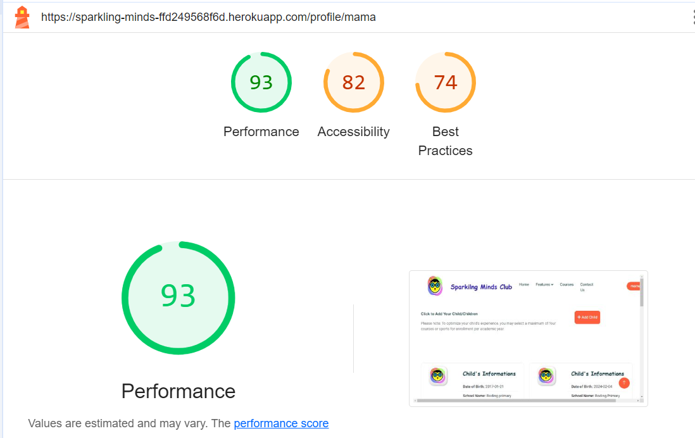
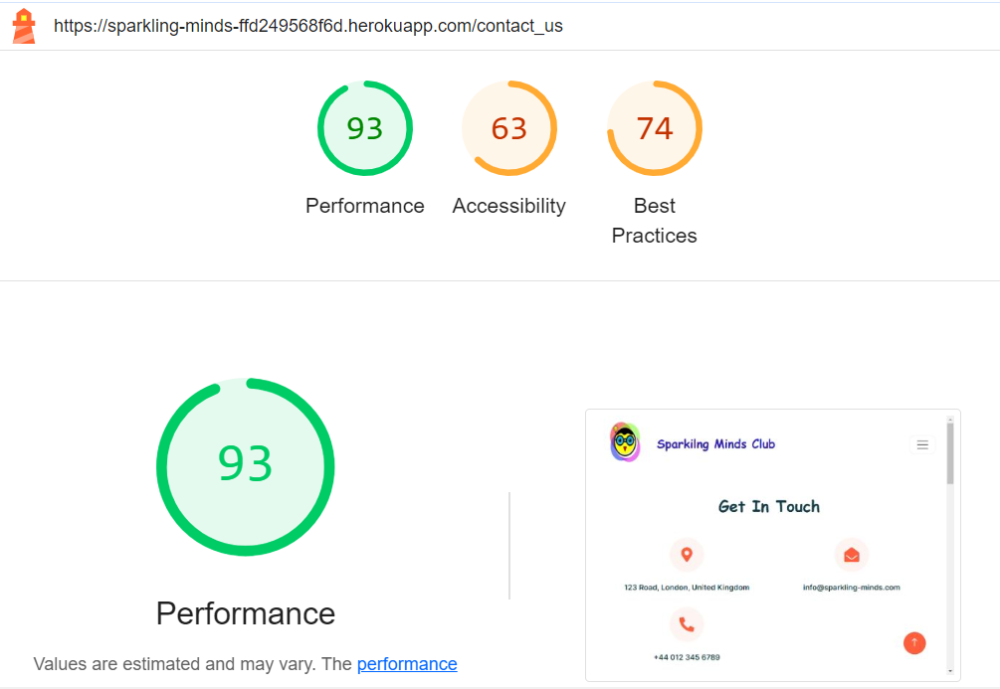
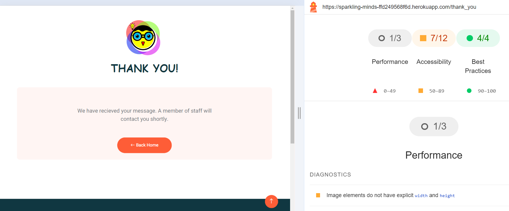

# Testing
-	## Manual Testing:
The app was tested as it has been built, checking each feature before merging into the master file. To ensure that it runs perfectly, and its features are working as expected, I asked friends/family and fellow coders to try out the site. This helped me see how different people used it on different devices and browsers. 
see the below table for the results.

| Action                             |  Expectation  |Result |
| -------------                      | :-----------: | -----: |
|On clicking the link of the website. | The user should land on the homepage. He should notice a header with a logo and a site Name at the top left, a navbar of four text links [Home, Features, Courses, Contact Us] in the middle and a font awesome user icon at the top right. | It is working well as expected and errors were found.
| Hovering over the logo and the site name.  | This should appear to be a link. Once it is clicked, the user should be taken to the homepage. In this case. the page should refresh as the user is still on the same page.  | It is working well as expected and errors were found.
| Hovering over the Home link.  | The user should notice the same header, but the text link is highlighted with blue color indicating that now the user is in the home page. | It is working well as expected and errors were found.
| Hovering over the Features link. | The user should notice that link now is highlighted with orange and dropdown menu will appear to four Subheadings. Clicking on each one will take the user down to its location on the same Home page. | It is working well as expected and errors were found.
| Hovering over the Courses link | The user should notice the text now is highlighted with orange. Once clicking on the it will change to blue, and the user will be directed to the courses page.   | It is working well as expected and errors were found.
|Scrolling down the Course page  | The user should notice a carousel of three hero images. When scrolling down there is a title of Our Courses with a group list of different courses, each list contains a photo of the course, course name, photo of teacher/couch, name of the teacher/couch, position, school year, Days of the course and Time of the course. **Note:** As a visitor, the user should see an orange link button that says Enroll Now. This button will disappear later once the user register on the website. | It is working well as expected and errors were found.
|Hovering over the Contact link | The user should notice the text now is highlighted with orange. Once clicking on the it will change to blue, and the user will be directed to the Contact Us page. | It is working well as expected and errors were found.
| Scrolling down the Contact page | The user should see a title of Get in Touch and three, orange font awesome icons of: location icon with text location address, envelope icon with email address and phone icon with a phone number. Underneath the user should see two section of a form to be filled on the left and a map of London City on the right. | It is working well as expected and errors were found.
| Fill in the Contact Form | The user should notice while filling in the form that all fields are mandatory and he can’t click the send button if he did not fill each field. Once he does, the user should see that he is being redirected to another page that has the logo in the middle and a title with Thank you.Underneath a box of short paragraph and an orange button that says back home. When the user clicks on it, he will return to the home page. | It is working well as expected and errors were found.
| Hovering over the font awesome user icon | The user should see a drop-down menu of sign in and Register. As a First-time user, he should click on register. Once clicked in, the user is redirected to the Sign-Up page. | It is working well as expected and errors were found.
| Hovering over the font awesome user icon | The user should see a drop-down menu of sign in and Register. As a First-time user, he should click on register. Once clicked in, the user is redirected to the Sign-Up page. | It is working well as expected and errors were found.
| Landing on the Sign up page | The user should see a title of Sign up and below will see two sections of a form to be filled on the left and a photo of children.| It is working well as expected and errors were found.
|Filling in the Registration Form | While filling the form, the user should notice each field has its own requirement, otherwise he would not be able to register.The user should keep save his username, the security question and its answer as he needs them later in case he forgot the password.|It is working well as expected and errors were found.
|After Registration |The user will be redirected to a profile page, with a quick flash message that he has been successfully registered. The user also should notice that his username is appearing along side the font awesome user icon. When clicking the icon, he should see that the drop-down menu lists now are profile and signout. Down the page the user will see a heading and a notation paragraph on the left and clickable button to add child on the right. |It is working well as expected and errors were found.
|Click on Add Child button |Once the user clicks on the button, he should see a collapsible box of form to fill and that while filling, each field has its own requirement, otherwise he would not be able to click the submit button. |It is working well as expected and errors were found.
|After Adding the child | The user will see a card of logo as the picture, the child’s name and all the data that has been fill by the user previously. The user will see two buttons related to the child either a delete child button or the edit child button.|It is working well as expected and errors were found.
|Click on Edit child button |Once the user clicks on the button, it will pop up to a form that has been prefilled with same information of the child information with the ability to update each field but still with the same requirements. The user has the option whether to save the changes by clicking the button save changes, or discard anything by clicking the cancel button. The user then will still be on the profile page.  |Working on it
| Click on Delete child|Once the user clicks on the delete button, he will notice that the child’s card with its information has been deleted and a flash message to confirm that. | It is working well as expected and errors were found.
| Click on Signout button from the font awesome user icon | Once the user clicks on button, he be notified with a flash message that he’s been signed out, then he will be redirected to the sign in page.  |   It is working well as expected and errors were found.
| Landing on the Sign in page | The user should see a title of Sign in, and below will see two sections of a form with two fields [ username and password] to be filled on the left and a photo of children. Underneath there two link of register if you are new or forgot your password.|  It is working well as expected and errors were found.
|Filling the sign in page |**Case1:** If the user filled in the username and the password correctly, he would get a flash message that he’s been signed in successfully and then he will be redirected to the profile page. **Case2:** I the user in the username or the password incorrectly, he would get a flash message indicating that his username/password was not recognised. |It is working well as expected and errors were found.
|Click on Forgot the password link | The user should see a title of assuring if you forgot your password, and below will see two sections of a form with three fields [ username, list of security question and an input for the answer to question] to be filled on the left and a photo of children.| It is working well as expected and errors were found.
| Filling the Forgot the password Form |  **Case1:** if the user put in an unrecognised username, he would get a flash message of incorrect username/answer and would be redirected to the sign in page.  **Case2:** if the user put in a correct username but chose a wrong security question, he would get a flash message of incorrect username/answer and would be still on the same forgot password page. **Case3:** if the user put in a correct username and a correct security question but wrote a wrong security answer, he would get a flash message of incorrect username/answer and would be still on the same forgot password page. **Case4:** if the user put in a correct username, correct security question and wrote the correct security answer, he would get a flash message of welcome back with his username and would land on a page where he is required to type a new password with its requirements for recovery.Once the user fill in the new password, he would be redirected to his profile page.|It is working well as expected and errors were found.
|Scrolling down the pages  | The user should see a footer of two rows.The first row is divided into three sections: 1-Get in touch that has the location, phone number and the email address for the site and underneath there are four buttons of social media icons. Once either has been clicked, it will open a new window tab of the related social media button. 2- Quick link that has four texts links of the site. Once either has been clicked, it would redirect the user to the desired page. 3- photo gallery that has sample of random pictures from the gallery section. The second row contains the logo and a copyrights links for the designer, distributor and the site developer. Once either has been clicked, it will open a new window tab of the related link. |It is working well as expected and errors were found.
| Click on links, button and arrows in site| All have been checked. |It is working well as expected and errors were found.
| Responsiveness of the website| Throughout building the site has been tested on desktop, tablet and mobile devices.|It is working well as expected and errors were found.

# Bugs
-	## Solved bugs.

- ## Validation
    -	HTML Validation:
 Full HTML Validation Report
No errors or warnings were found when passing through the official W3C validator. This checking was done manually by copying the view page source code (Ctrl+U) and pasting it into the validator.
    - 	CSS Validation:
Full CSS Validation Report
No errors or warnings were found when passing through the official W3C (Jigsaw) .

    -	JS Validation:
Full JS Validation Report
No errors or warning messages were found when passing through the official JSHint validator

    -	Python Validation:
Full Python Validation Report
No errors were found when the code was passed through an online validation tool.

- ## Lighthouse Report
    -	Home page
         
    -	Courses Page
        
    -	Register Page
        
    -	Sign in Page
        
    -	Profile Page
        
    -	Contact Us Page
        
    -	Thank You Page
        

- ## Compatibility
	Testing was conducted on Chrome’s browser:
    - Chrome 
    - Firfox
